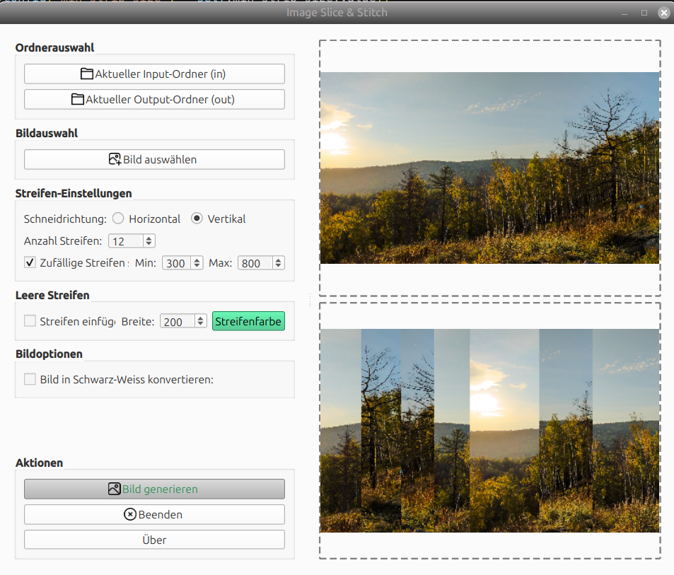

# Image Slice & Stitch

Ein Python-Programm, das Bilder in Streifen schneidet und neu zusammensetzt. Ideal für kreative Bildbearbeitung oder zur Erstellung von einzigartigen Designs.

## Features

- Schneidet Bilder horizontal oder vertikal in Streifen.
- Unterstützt zufällige Streifenbreiten.
- Fügt optionale leere Streifen mit benutzerdefinierter Farbe hinzu.
- Konvertiert Bilder in Schwarz-Weiß.
- Vorschau des Eingabebildes und des generierten Bildes.
- Unterstützt Drag & Drop für die Bildauswahl.

## Screenshot




## Example


## Voraussetzungen

- Python 3.8 oder höher
- Abhängigkeiten aus der Datei `requirements.txt`

## Installation

1. **Repository klonen**  
   Klone das Repository von GitHub:
   ```bash
   git clone https://github.com/tcicit/image-slice-stitch.git
   cd image-slice-stitch

2. **Python installieren**  
   Installiere Python wenn noch nicht vorhanden 

3. **Virtual Environement aktivieren**
   python3 -m venv ./venv
   source ./venv/bin/activate

4. **Zusätzliche Python Module installiern**
   pip install -r requirements.txt


## Erstellen eines eigenständigen Programms mit PyInstaller

Um ein eigenständiges ausführbares Programm mit PyInstaller zu erstellen, folge diesen Schritten:

1. **PyInstaller installieren**  
   Installiere PyInstaller in deiner virtuellen Umgebung:
   ```bash
   pip install pyinstaller
   ```

2. **Das ausführbare Programm generieren**  
   Führe den folgenden Befehl aus, um ein eigenständiges ausführbares Programm zu erstellen:
   ```bash
   pyinstaller --onefile --windowed main.py
   ```
   - `--onefile`: Bündelt alles in einer einzigen ausführbaren Datei.
   - `--windowed`: Verhindert, dass beim Starten des Programms ein Konsolenfenster angezeigt wird (nützlich für GUI-Anwendungen).

3. **Das ausführbare Programm finden**  
   Nach Abschluss des Prozesses befindet sich das ausführbare Programm im Ordner `dist`.

4. **Das ausführbare Programm ausführen**  
   Navigiere in den Ordner `dist` und führe die generierte ausführbare Datei aus:
   ```bash
   ./main
   ```

5. **Das Programm verteilen**  
   Du kannst die ausführbare Datei jetzt mit anderen teilen. Beachte, dass diese kein Python oder zusätzliche Abhängigkeiten installieren müssen, um das Programm auszuführen.

### Hinweise
- Stelle sicher, dass alle benötigten Dateien (z. B. Bilder, Konfigurationsdateien) im selben Verzeichnis wie die ausführbare Datei enthalten sind oder mit der Option `--add-data` von PyInstaller gebündelt werden.
- Für weitere Informationen oder zur Fehlerbehebung siehe die [PyInstaller-Dokumentation](https://pyinstaller.org/).


-------

# Image Slice & Stitch

A Python program that slices images into strips and reassembles them. Perfect for creative image editing or generating unique designs.

## Features

- Slice images into horizontal or vertical strips.
- Support for random strip widths.
- Add optional blank strips with customizable colors.
- Convert images to grayscale.
- Preview both the input image and the generated image.
- Drag-and-drop support for image selection.

## Requirements

- Python 3.8 or higher
- Dependencies listed in `requirements.txt`

## Installation

1. **Clone the repository**  
   Clone the repository from GitHub:
   ```bash
   git clone https://github.com/tcicit/image-slice-stitch.git
   cd image-slice-stitch
   ```

2. **Install Python**  
   Ensure Python is installed on your system.

3. **Set up a virtual environment**  
   Create and activate a virtual environment:
   ```bash
   python3 -m venv ./venv
   source ./venv/bin/activate
   ```

4. **Install dependencies**  
   Install the required Python modules:
   ```bash
   pip install -r requirements.txt
   ```

## Create a Standalone Program with PyInstaller

To create a standalone executable for the program using PyInstaller, follow these steps:

1. **Install PyInstaller**  
   Install PyInstaller in your virtual environment:
   ```bash
   pip install pyinstaller
   ```

2. **Generate the Executable**  
   Run the following command to create a standalone executable:
   ```bash
   pyinstaller --onefile --windowed main.py
   ```
   - `--onefile`: Packages everything into a single executable file.
   - `--windowed`: Ensures no console window appears when running the program (useful for GUI applications).

3. **Locate the Executable**  
   After the process completes, the standalone executable will be located in the `dist` folder.

4. **Run the Executable**  
   Navigate to the `dist` folder and run the generated executable:
   ```bash
   ./main
   ```

5. **Distribute the Program**  
   You can now share the standalone executable with others. Note that they do not need to install Python or any dependencies to run the program.

### Notes
- Ensure all required files (e.g., images, configuration files) are included in the same directory as the executable or bundled using PyInstaller's `--add-data` option.
- For troubleshooting, refer to the PyInstaller [documentation](https://pyinstaller.org/).
